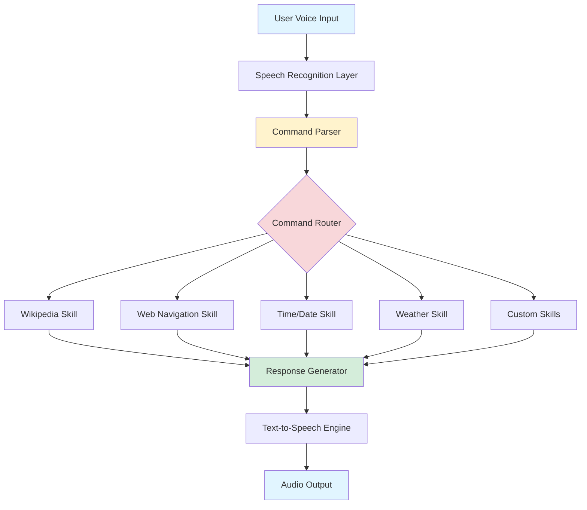

# JARVIS AI Assistant

<div align="center">

**An advanced voice-activated AI assistant inspired by Iron Man's JARVIS**

[](https://www.python.org/downloads/)
[](https://opensource.org/licenses/MIT)

[Quick Start](#-quick-start) • [Features](#-features) • [Documentation](#-documentation) • [Contributing](#-contributing)

</div>

---

## 📋 Overview

JARVIS is a modular, extensible voice assistant that combines speech recognition, natural language processing, and various online services to provide a hands-free computing experience. Whether you're looking for information, controlling your computer, or automating tasks, JARVIS is designed to be your personal AI companion.

### Key Highlights

- 🎤 **Voice Interaction**: Natural speech recognition and text-to-speech responses
- 🧩 **Modular Design**: Easy-to-extend skill system for adding new capabilities
- 🔒 **Privacy-Focused**: Local processing with optional cloud service integration
- 🛠️ **Developer-Friendly**: Clear APIs and extensive documentation for customization
- ⚡ **Lightweight**: Minimal dependencies and fast response times

## ✨ Features

### Current Capabilities

| Feature | Description |
|---------|-------------|
| **Voice Recognition** | Listen and respond to voice commands using Google Speech Recognition |
| **Text-to-Speech** | Natural voice responses using pyttsx3 engine |
| **Wikipedia Integration** | Quick access to Wikipedia summaries on any topic |
| **Web Navigation** | Open popular websites (YouTube, Google) with voice commands |
| **Time Queries** | Get current time on demand |
| **Weather Reports** | Real-time weather information via OpenWeatherMap API |
| **Extensible Architecture** | Easy framework for adding custom skills and commands |

### Planned Features

- 🎨 Graphical user interface (GUI) for visual interaction
- 🧠 Long-term memory and conversation context
- 📧 Email and calendar integration
- 🏠 Smart home device control
- 📊 Task automation and scheduling
- 🔌 Plugin ecosystem

## 🏗️ Architecture

JARVIS follows a clean, modular architecture that separates concerns and makes extension straightforward:



### Component Overview

- **Speech Recognition Layer**: Captures and transcribes voice input
- **Command Parser**: Extracts intent and parameters from user queries
- **Command Router**: Dispatches commands to appropriate skill handlers
- **Skill Modules**: Individual handlers for specific capabilities
- **Response Generator**: Formats results for user consumption
- **TTS Engine**: Converts text responses to natural speech

## 🚀 Quick Start

### Prerequisites

- Python 3.8 or higher
- Microphone for voice input
- Internet connection (for cloud services)
- Operating System: Windows, macOS, or Linux

### Installation

1. **Clone the repository**
   ```bash
   git clone https://github.com/yourusername/jarvis-ai-assistant.git
   cd jarvis-ai-assistant
   ```

2. **Create a virtual environment**
   ```bash
   python -m venv .venv
   
   # On Windows
   .venv\Scripts\activate
   
   # On macOS/Linux
   source .venv/bin/activate
   ```

3. **Install dependencies**
   ```bash
   pip install -r requirements.txt
   ```

4. **Install system dependencies**
   
   **On Windows:**
   - PyAudio should install automatically with pip
   - If issues occur, download the wheel from [here](https://www.lfd.uci.edu/~gohlke/pythonlibs/#pyaudio)
   
   **On macOS:**
   ```bash
   brew install portaudio
   pip install pyaudio
   ```
   
   **On Linux (Ubuntu/Debian):**
   ```bash
   sudo apt-get install python3-pyaudio portaudio19-dev
   ```

5. **Configure API keys** (optional but recommended)
   
   Create a `config.json` file in the project root:
   ```json
   {
     "openweathermap_api_key": "your_api_key_here",
     "openweathermap_city": "your_city_name",
     "wolframalpha_api_key": "your_api_key_here"
   }
   ```

6. **Run JARVIS**
   ```bash
   python jarvis.txt
   ```

### First Interaction

After starting JARVIS, you'll be greeted based on the time of day. Try these commands:

- "Wikipedia artificial intelligence"
- "What time is it?"
- "Open YouTube"
- "Open Google"
- "What's the weather?"
- "Exit" (to quit)

## 📚 Documentation

Comprehensive guides are available in the `docs/` directory:

| Document | Description |
|----------|-------------|
| [Setup Guide](docs/setup.md) | Detailed installation instructions for all platforms |
| [Configuration Guide](docs/configuration.md) | API setup, voice settings, and customization |
| [Developer Guide](docs/developer-guide.md) | Architecture deep-dive and extension patterns |
| [Skill Authoring](docs/skill-authoring.md) | Step-by-step guide to creating custom skills |
| [Memory System](docs/memory-internals.md) | Understanding context and state management |
| [GUI Usage](docs/gui-usage.md) | Visual interface guide (planned feature) |
| [Security Best Practices](docs/security.md) | API key management and privacy considerations |

## 🛠️ Configuration

### Voice Settings

Customize the voice characteristics in your code:

```python
# Change voice (0 = male, 1 = female on most systems)
self.engine.setProperty('voice', self.voices[1].id)

# Adjust speech rate (default: 200)
self.engine.setProperty('rate', 150)

# Adjust volume (0.0 to 1.0)
self.engine.setProperty('volume', 0.9)
```

### Recognition Settings

Fine-tune speech recognition:

```python
# Pause threshold (seconds of silence before phrase ends)
self.recognizer.pause_threshold = 1

# Energy threshold (adjust for noisy environments)
self.recognizer.energy_threshold = 4000
```

## 🧩 Adding Custom Skills

JARVIS is designed to be easily extended. Here's a quick example:

```python
def process_command(self, query):
    # Add your custom skill
    if 'calculate' in query:
        self.speak('What would you like me to calculate?')
        expression = self.take_command()
        try:
            result = eval(expression)  # Note: Use safely in production
            self.speak(f'The answer is {result}')
        except:
            self.speak('Sorry, I could not calculate that')
    
    # ... existing commands ...
```

See the [Skill Authoring Guide](docs/skill-authoring.md) for comprehensive examples.

## 🔒 Security Considerations

> **⚠️ Important**: JARVIS can execute commands and access online services. Follow these best practices:

- **API Keys**: Never commit API keys to version control. Use environment variables or config files (gitignored)
- **Voice Privacy**: Be aware that voice data is sent to Google's servers for recognition
- **Command Validation**: Validate and sanitize all inputs before executing system commands
- **Network Security**: Use HTTPS for all API calls and validate SSL certificates
- **Minimal Permissions**: Run JARVIS with minimal user permissions, not as administrator

See [Security Best Practices](docs/security.md) for detailed guidance.

## 🐛 Troubleshooting

### Common Issues

**Microphone not detected:**
```bash
# Test your microphone
python -c "import speech_recognition as sr; print(sr.Microphone.list_microphone_names())"
```

**Speech recognition errors:**
- Check internet connection (Google Speech Recognition requires internet)
- Adjust the `energy_threshold` for your environment
- Ensure microphone permissions are granted

**Voice not working:**
- On Windows, ensure SAPI5 is installed
- On macOS/Linux, install additional TTS engines if needed
- Check audio output device settings

**API calls failing:**
- Verify API keys are correctly configured
- Check API service status and rate limits
- Ensure firewall allows outbound connections

See [Troubleshooting Guide](docs/setup.md#troubleshooting) for more solutions.

## 📖 Example Commands

| Command | Action |
|---------|--------|
| "Wikipedia Python programming" | Fetches and reads Wikipedia summary |
| "What time is it?" | Announces current time |
| "Open YouTube" | Opens YouTube in default browser |
| "Open Google" | Opens Google in default browser |
| "What's the weather?" | Reports current weather conditions |
| "Exit" or "Goodbye" | Exits the program |

## 🤝 Contributing

We welcome contributions! Here's how you can help:

1. Fork the repository
2. Create a feature branch (`git checkout -b feature/amazing-feature`)
3. Commit your changes (`git commit -m 'Add amazing feature'`)
4. Push to the branch (`git push origin feature/amazing-feature`)
5. Open a Pull Request

### Development Setup

```bash
# Install development dependencies
pip install -r requirements-dev.txt

# Run tests
pytest tests/

# Check code style
flake8 *.py
black --check *.py
```

## 📄 License

This project is licensed under the MIT License - see the [LICENSE](LICENSE) file for details.

## 🙏 Acknowledgments

- Speech recognition powered by [Google Speech Recognition API](https://cloud.google.com/speech-to-text)
- Text-to-speech using [pyttsx3](https://github.com/nateshmbhat/pyttsx3)
- Weather data from [OpenWeatherMap](https://openweathermap.org/)
- Computational knowledge from [Wolfram Alpha](https://www.wolframalpha.com/)
- Information retrieval via [Wikipedia API](https://www.wikipedia.org/)

## 🚀 Roadmap

- [ ] Implement GUI with PyQt or Tkinter
- [ ] Add conversation context and memory
- [ ] Create plugin architecture
- [ ] Add natural language understanding improvements
- [ ] Implement local wake word detection
- [ ] Add multi-language support
- [ ] Create mobile companion app
- [ ] Add smart home integrations
- [ ] Implement task automation workflows

## 📧 Support

- **Documentation**: Check the [docs/](docs/) directory
- **Issues**: Report bugs via [GitHub Issues](https://github.com/yourusername/jarvis-ai-assistant/issues)
- **Discussions**: Join conversations in [GitHub Discussions](https://github.com/yourusername/jarvis-ai-assistant/discussions)

---

<div align="center">

Made with ❤️ by the JARVIS community

[⬆ Back to Top](#jarvis-ai-assistant)

</div>
