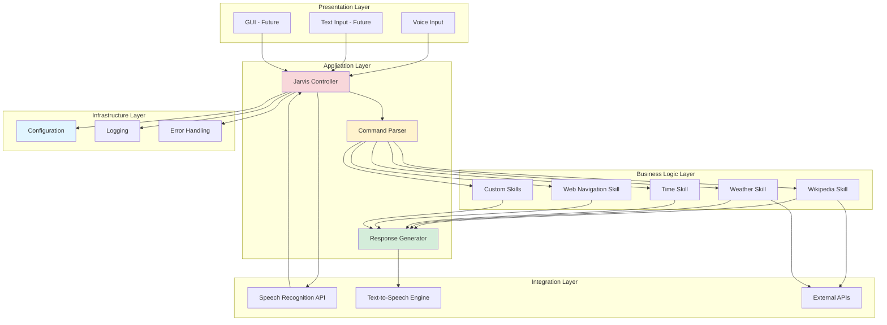
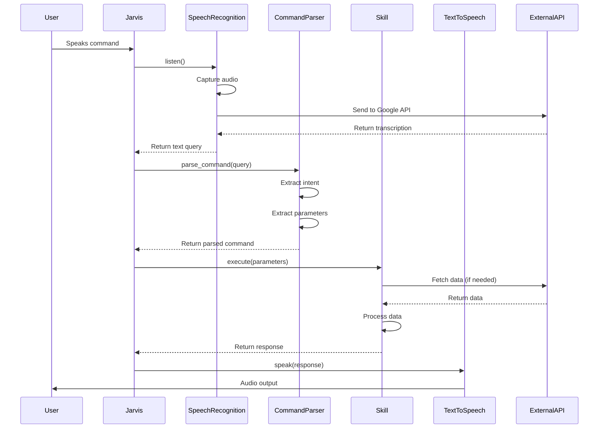

# Developer Guide

Deep dive into JARVIS architecture, design patterns, and best practices for contributing and extending the system.

## Table of Contents

- [Architecture Overview](#architecture-overview)
- [Core Components](#core-components)
- [Request Flow](#request-flow)
- [Design Patterns](#design-patterns)
- [Extending JARVIS](#extending-jarvis)
- [Code Organization](#code-organization)
- [Contributing Guidelines](#contributing-guidelines)

## Architecture Overview

JARVIS follows a layered architecture with clear separation of concerns:



### Layer Responsibilities

| Layer | Responsibility | Examples |
|-------|---------------|----------|
| **Presentation** | User interaction interfaces | Voice, Text, GUI |
| **Application** | Orchestration and control flow | Main loop, routing |
| **Business Logic** | Core features and skills | Wikipedia, Weather, etc. |
| **Integration** | External service communication | APIs, Speech services |
| **Infrastructure** | Cross-cutting concerns | Config, Logging, Errors |

## Core Components

### 1. Jarvis Class

The main controller that orchestrates all operations.

```python
class Jarvis:
    """Main JARVIS controller"""
    
    def __init__(self, config_path='config.json'):
        """
        Initialize JARVIS with configuration
        
        Args:
            config_path: Path to configuration file
        """
        self.config = self.load_config(config_path)
        self.engine = self._initialize_tts()
        self.recognizer = self._initialize_recognizer()
        self.context = {}  # Conversation context
    
    def _initialize_tts(self):
        """Initialize text-to-speech engine"""
        # Implementation
        pass
    
    def _initialize_recognizer(self):
        """Initialize speech recognizer"""
        # Implementation
        pass
```

**Responsibilities:**
- Initialize and manage subsystems
- Coordinate between components
- Maintain application state
- Handle lifecycle management

### 2. Speech Recognition Layer

Captures and transcribes user voice input.

```python
def take_command(self, timeout=5, phrase_time_limit=None):
    """
    Listen for and transcribe user voice command
    
    Args:
        timeout: Maximum time to wait for speech
        phrase_time_limit: Maximum length of phrase
    
    Returns:
        str: Transcribed command or "None" on failure
    """
    with sr.Microphone() as source:
        print("Listening...")
        self.recognizer.pause_threshold = self.config.get(
            'recognition', {}
        ).get('pause_threshold', 1.0)
        
        try:
            audio = self.recognizer.listen(
                source, 
                timeout=timeout,
                phrase_time_limit=phrase_time_limit
            )
            
            query = self.recognizer.recognize_google(
                audio,
                language=self.config.get('recognition', {}).get('language', 'en-US')
            )
            
            return query.lower()
            
        except sr.WaitTimeoutError:
            return "None"
        except sr.UnknownValueError:
            return "None"
        except Exception as e:
            logger.error(f"Recognition error: {e}")
            return "None"
```

### 3. Command Parser

Interprets user intent and extracts parameters.

```python
def parse_command(self, query):
    """
    Parse user command to extract intent and parameters
    
    Args:
        query: Raw user command
    
    Returns:
        dict: Parsed command with intent and parameters
    """
    command = {
        'intent': None,
        'parameters': {},
        'raw': query
    }
    
    # Intent detection
    if 'wikipedia' in query:
        command['intent'] = 'wikipedia_search'
        command['parameters']['topic'] = query.replace('wikipedia', '').strip()
    
    elif 'weather' in query:
        command['intent'] = 'weather_query'
        # Extract city if mentioned
        # command['parameters']['city'] = extracted_city
    
    elif 'time' in query:
        command['intent'] = 'time_query'
    
    # ... more intent detection
    
    return command
```

### 4. Skill Handler

Base class for skill implementation (future enhancement).

```python
class SkillHandler:
    """Base class for JARVIS skills"""
    
    def __init__(self, jarvis_instance):
        self.jarvis = jarvis_instance
    
    def can_handle(self, query):
        """
        Check if this skill can handle the query
        
        Args:
            query: User command
        
        Returns:
            bool: True if skill can handle this query
        """
        raise NotImplementedError
    
    def handle(self, query):
        """
        Execute the skill
        
        Args:
            query: User command
        
        Returns:
            str: Response to user
        """
        raise NotImplementedError
    
    def speak(self, text):
        """Convenience method to speak"""
        self.jarvis.speak(text)
```

Example skill implementation:

```python
class WeatherSkill(SkillHandler):
    """Handle weather queries"""
    
    def can_handle(self, query):
        return 'weather' in query
    
    def handle(self, query):
        api_key = self.jarvis.config.get('apis', {}).get('openweathermap', {}).get('api_key')
        city = self.jarvis.config.get('apis', {}).get('openweathermap', {}).get('city')
        
        # Fetch weather data
        # ...
        
        return f"The weather in {city} is..."
```

## Request Flow

### Voice Command Processing



### Detailed Flow Steps

1. **Audio Capture**
   - Microphone captures audio stream
   - VAD (Voice Activity Detection) determines speech segments
   - Audio buffered until silence threshold

2. **Transcription**
   - Audio sent to Google Speech Recognition API
   - Returns text transcription
   - Fallback to "None" on error

3. **Intent Recognition**
   - Analyze transcription for keywords
   - Determine which skill should handle request
   - Extract relevant parameters

4. **Skill Execution**
   - Selected skill processes request
   - May call external APIs
   - May access local resources
   - Returns formatted response

5. **Response Generation**
   - Format response for user consumption
   - Convert to natural language if needed
   - Prepare for TTS

6. **Audio Output**
   - Text sent to TTS engine
   - Engine generates audio
   - Audio played through speakers

## Design Patterns

### 1. Command Pattern

Each skill represents a command that can be executed:

```python
class Command:
    """Abstract command"""
    def execute(self):
        pass

class WikipediaCommand(Command):
    def __init__(self, query):
        self.query = query
    
    def execute(self):
        # Wikipedia search logic
        pass
```

### 2. Strategy Pattern

Different strategies for different skills:

```python
class SkillStrategy:
    """Abstract strategy for skills"""
    def execute(self, query):
        pass

class WeatherStrategy(SkillStrategy):
    def execute(self, query):
        # Weather logic
        pass

class TimeStrategy(SkillStrategy):
    def execute(self, query):
        # Time logic
        pass

class Jarvis:
    def __init__(self):
        self.strategies = {
            'weather': WeatherStrategy(),
            'time': TimeStrategy(),
            # ... more strategies
        }
```

### 3. Observer Pattern

For event-driven features (future enhancement):

```python
class EventManager:
    """Manage events and observers"""
    def __init__(self):
        self.observers = {}
    
    def subscribe(self, event_type, callback):
        if event_type not in self.observers:
            self.observers[event_type] = []
        self.observers[event_type].append(callback)
    
    def notify(self, event_type, data):
        if event_type in self.observers:
            for callback in self.observers[event_type]:
                callback(data)

# Usage
events = EventManager()
events.subscribe('command_received', log_command)
events.subscribe('command_received', analyze_sentiment)
events.notify('command_received', {'query': 'weather'})
```

### 4. Factory Pattern

Create skills dynamically:

```python
class SkillFactory:
    """Factory for creating skill handlers"""
    
    @staticmethod
    def create_skill(skill_type, jarvis_instance):
        skills = {
            'weather': WeatherSkill,
            'wikipedia': WikipediaSkill,
            'time': TimeSkill,
            'web': WebNavigationSkill
        }
        
        skill_class = skills.get(skill_type)
        if skill_class:
            return skill_class(jarvis_instance)
        else:
            raise ValueError(f"Unknown skill type: {skill_type}")

# Usage
weather_skill = SkillFactory.create_skill('weather', jarvis)
weather_skill.handle('what is the weather')
```

## Extending JARVIS

### Adding a New Skill

**Step 1: Create Skill Class**

```python
class NewsSkill(SkillHandler):
    """Fetch and read news headlines"""
    
    def __init__(self, jarvis_instance):
        super().__init__(jarvis_instance)
        self.api_key = self.jarvis.config.get('apis', {}).get('news', {}).get('api_key')
    
    def can_handle(self, query):
        return 'news' in query or 'headlines' in query
    
    def handle(self, query):
        try:
            # Fetch news
            url = f"https://newsapi.org/v2/top-headlines?apiKey={self.api_key}&country=us"
            response = requests.get(url)
            data = response.json()
            
            headlines = [article['title'] for article in data['articles'][:5]]
            
            self.speak("Here are the top headlines")
            for i, headline in enumerate(headlines, 1):
                self.speak(f"Headline {i}: {headline}")
            
            return "News headlines delivered"
        except Exception as e:
            self.speak("Could not fetch news")
            logger.error(f"News fetch error: {e}")
            return "Error fetching news"
```

**Step 2: Register Skill**

```python
class Jarvis:
    def __init__(self):
        # ... existing initialization ...
        
        # Register skills
        self.skills = [
            WeatherSkill(self),
            WikipediaSkill(self),
            TimeSkill(self),
            NewsSkill(self),  # Add new skill
        ]
    
    def process_command(self, query):
        """Process command using registered skills"""
        for skill in self.skills:
            if skill.can_handle(query):
                skill.handle(query)
                return
        
        # No skill matched
        self.speak("I'm not sure how to help with that")
```

### Adding Configuration Options

**Step 1: Define Schema**

```python
# config_schema.py
CONFIG_SCHEMA = {
    'voice': {
        'rate': (int, 50, 400),  # (type, min, max)
        'volume': (float, 0.0, 1.0),
        'voice_index': (int, 0, None)
    },
    'recognition': {
        'pause_threshold': (float, 0.1, 5.0),
        'energy_threshold': (int, 0, None),
        'language': (str, None, None)
    }
}
```

**Step 2: Validate Configuration**

```python
def validate_config(config, schema):
    """Validate configuration against schema"""
    errors = []
    
    for section, fields in schema.items():
        for field, constraints in fields.items():
            value = config.get(section, {}).get(field)
            
            if value is not None:
                expected_type, min_val, max_val = constraints
                
                # Type check
                if not isinstance(value, expected_type):
                    errors.append(f"{section}.{field}: Expected {expected_type.__name__}")
                
                # Range check
                if min_val is not None and value < min_val:
                    errors.append(f"{section}.{field}: Below minimum {min_val}")
                
                if max_val is not None and value > max_val:
                    errors.append(f"{section}.{field}: Above maximum {max_val}")
    
    return errors
```

## Code Organization

### Recommended Project Structure

```
jarvis-ai-assistant/
├── jarvis/
│   ├── __init__.py
│   ├── core.py                 # Main Jarvis class
│   ├── config.py               # Configuration management
│   ├── skills/
│   │   ├── __init__.py
│   │   ├── base.py            # SkillHandler base class
│   │   ├── weather.py         # Weather skill
│   │   ├── wikipedia.py       # Wikipedia skill
│   │   ├── time.py            # Time skill
│   │   └── web.py             # Web navigation skill
│   ├── utils/
│   │   ├── __init__.py
│   │   ├── speech.py          # Speech recognition utilities
│   │   ├── tts.py             # Text-to-speech utilities
│   │   └── parsers.py         # Command parsing utilities
│   └── integrations/
│       ├── __init__.py
│       ├── weather_api.py     # Weather API client
│       └── wikipedia_api.py   # Wikipedia API client
├── tests/
│   ├── test_skills.py
│   ├── test_config.py
│   └── test_utils.py
├── docs/
│   ├── setup.md
│   ├── configuration.md
│   ├── developer-guide.md
│   └── skill-authoring.md
├── config.json                 # Configuration file
├── requirements.txt            # Dependencies
├── setup.py                    # Package setup
├── main.py                     # Entry point
└── README.md
```

### Refactoring Current Code

Transform the monolithic `jarvis.txt` into a modular structure:

**jarvis/core.py:**
```python
from jarvis.config import Config
from jarvis.skills import skill_registry
from jarvis.utils.speech import SpeechRecognizer
from jarvis.utils.tts import TextToSpeech

class Jarvis:
    def __init__(self, config_path='config.json'):
        self.config = Config(config_path)
        self.tts = TextToSpeech(self.config)
        self.recognizer = SpeechRecognizer(self.config)
        self.skills = skill_registry.get_all_skills(self)
    
    def process_command(self, query):
        for skill in self.skills:
            if skill.can_handle(query):
                response = skill.handle(query)
                if response:
                    self.tts.speak(response)
                return
        
        self.tts.speak("I didn't understand that")
```

## Contributing Guidelines

### Code Style

Follow PEP 8 style guide:

```bash
# Install tools
pip install black flake8 isort

# Format code
black jarvis/

# Check style
flake8 jarvis/

# Sort imports
isort jarvis/
```

### Documentation

Every function should have a docstring:

```python
def process_command(self, query):
    """
    Process a user command and execute appropriate skill.
    
    This method iterates through registered skills and finds
    the first one that can handle the query. If no skill matches,
    a default response is provided.
    
    Args:
        query (str): The user's voice command in lowercase
    
    Returns:
        None: Response is spoken to user
    
    Raises:
        None: All exceptions are caught and handled gracefully
    
    Example:
        >>> jarvis.process_command("what time is it")
        # Speaks current time
    """
    # Implementation
```

### Testing

Write tests for new features:

```python
import unittest
from jarvis.core import Jarvis

class TestJarvis(unittest.TestCase):
    def setUp(self):
        self.jarvis = Jarvis('test_config.json')
    
    def test_weather_skill_triggered(self):
        # Mock the weather API
        with patch('jarvis.skills.weather.requests.get') as mock_get:
            mock_get.return_value.json.return_value = {
                'main': {'temp': 20},
                'weather': [{'description': 'clear sky'}]
            }
            
            # Process weather command
            self.jarvis.process_command('what is the weather')
            
            # Assert API was called
            mock_get.assert_called_once()
```

### Pull Request Process

1. **Fork and Clone**
   ```bash
   git clone https://github.com/yourusername/jarvis-ai-assistant.git
   ```

2. **Create Feature Branch**
   ```bash
   git checkout -b feature/amazing-feature
   ```

3. **Make Changes**
   - Write code
   - Add tests
   - Update documentation

4. **Run Tests**
   ```bash
   pytest tests/
   ```

5. **Commit Changes**
   ```bash
   git commit -m "Add amazing feature"
   ```

6. **Push and Create PR**
   ```bash
   git push origin feature/amazing-feature
   ```

### Commit Messages

Follow conventional commits:

```
feat: add news headline skill
fix: correct weather API temperature conversion
docs: update setup guide for macOS
test: add tests for time skill
refactor: extract speech recognition to separate module
```

## Performance Optimization

### Async Processing

Use async for I/O-bound operations:

```python
import asyncio
import aiohttp

async def fetch_weather_async(city, api_key):
    """Async weather fetch"""
    url = f"http://api.openweathermap.org/data/2.5/weather?q={city}&appid={api_key}"
    
    async with aiohttp.ClientSession() as session:
        async with session.get(url) as response:
            return await response.json()

# Usage
loop = asyncio.get_event_loop()
weather_data = loop.run_until_complete(fetch_weather_async('London', api_key))
```

### Caching

Cache expensive operations:

```python
from functools import lru_cache
import time

@lru_cache(maxsize=128)
def cached_wikipedia_search(topic):
    """Cache Wikipedia results for 5 minutes"""
    return wikipedia.summary(topic, sentences=2)
```

### Lazy Loading

Load heavy resources only when needed:

```python
class Jarvis:
    def __init__(self):
        self._wolframalpha_client = None
    
    @property
    def wolframalpha_client(self):
        """Lazy load Wolfram Alpha client"""
        if self._wolframalpha_client is None:
            api_key = self.config.get('apis', {}).get('wolframalpha', {}).get('api_key')
            self._wolframalpha_client = wolframalpha.Client(api_key)
        return self._wolframalpha_client
```

## Next Steps

- **Add custom skills**: See [Skill Authoring Guide](skill-authoring.md)
- **Configure APIs**: See [Configuration Guide](configuration.md)
- **Learn about memory**: See [Memory Internals](memory-internals.md)

---

**Questions?** Open an issue on GitHub or check the [Setup Guide](setup.md) for troubleshooting.
