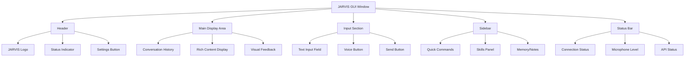

# GUI Usage Guide

This guide covers the graphical user interface for JARVIS, providing a visual way to interact with your AI assistant.

> **Note**: The GUI is a planned feature. This documentation provides the design vision and implementation roadmap. The current version of JARVIS operates via command-line interface with voice interaction.

## Table of Contents

- [Overview](#overview)
- [Planned Features](#planned-features)
- [Interface Design](#interface-design)
- [Implementation Roadmap](#implementation-roadmap)
- [Creating the GUI](#creating-the-gui)
- [GUI Alternatives](#gui-alternatives)

## Overview

The JARVIS GUI will provide:

- Visual feedback for voice interactions
- Text-based command input as an alternative to voice
- Real-time status indicators
- Configuration interface
- Command history display
- Visual skill outputs (charts, images, web results)

### Why Add a GUI?

Benefits of a graphical interface:

- **Accessibility**: Some users prefer visual interaction
- **Debugging**: See what JARVIS is processing in real-time
- **Configuration**: Easier setup without editing config files
- **Rich Output**: Display images, charts, and formatted text
- **History**: Visual command and response history
- **Multi-modal**: Combine voice and text input

## Planned Features

### Main Window Components



### Feature List

| Feature | Description | Priority |
|---------|-------------|----------|
| **Voice Visualization** | Animated waveform during speech | High |
| **Chat Interface** | WhatsApp-style conversation view | High |
| **Text Input** | Type commands as alternative to voice | High |
| **Status Indicators** | Show listening, processing, speaking states | High |
| **Settings Panel** | Configure all options visually | Medium |
| **Theme Support** | Light/Dark themes | Medium |
| **Skill Shortcuts** | Quick buttons for common commands | Medium |
| **History Search** | Search past conversations | Low |
| **Export Conversations** | Save chat history | Low |
| **Plugin Manager** | Visual skill management | Low |

## Interface Design

### Main Window Mockup

```
┌─────────────────────────────────────────────────────────────┐
│  🤖 JARVIS                    ⚪ Idle            ⚙️ Settings │
├─────────────────────────────────────────────────────────────┤
│                                                               │
│  Conversation History                                         │
│  ┌─────────────────────────────────────────────────────┐   │
│  │                                                       │   │
│  │  👤 User: What's the weather?                        │   │
│  │                                                       │   │
│  │  🤖 JARVIS: The weather in London is 15°C           │   │
│  │             with partly cloudy skies.                │   │
│  │                                                       │   │
│  │  👤 User: Tell me a joke                             │   │
│  │                                                       │   │
│  │  🤖 JARVIS: Why do programmers prefer dark mode?    │   │
│  │             Because light attracts bugs!             │   │
│  │                                                       │   │
│  └─────────────────────────────────────────────────────┘   │
│                                                               │
├─────────────────────────────────────────────────────────────┤
│  Type your command...                      🎤 Voice   ➤ Send │
└─────────────────────────────────────────────────────────────┘
│  🟢 Connected  |  🎤 Microphone Ready  |  🌐 APIs Online     │
└─────────────────────────────────────────────────────────────┘
```

### Color Scheme

**Light Theme:**
- Background: `#F5F5F5`
- User messages: `#E3F2FD` (light blue)
- JARVIS messages: `#E8F5E9` (light green)
- Accent: `#2196F3` (blue)

**Dark Theme:**
- Background: `#1E1E1E`
- User messages: `#1E3A5F` (dark blue)
- JARVIS messages: `#1E4D2B` (dark green)
- Accent: `#64B5F6` (light blue)

## Implementation Roadmap

### Phase 1: Basic GUI (Core Features)

**Goal**: Working GUI with essential features

- [ ] Create main window with tkinter/PyQt
- [ ] Add text input field
- [ ] Display conversation history
- [ ] Integrate with existing JARVIS core
- [ ] Add voice button
- [ ] Show status indicators

**Estimated Time**: 2-3 weeks

### Phase 2: Enhanced Interaction

**Goal**: Improve user experience

- [ ] Add voice visualization
- [ ] Implement real-time feedback
- [ ] Add theme support (light/dark)
- [ ] Create settings panel
- [ ] Add keyboard shortcuts
- [ ] Implement history search

**Estimated Time**: 2-3 weeks

### Phase 3: Advanced Features

**Goal**: Rich, feature-complete interface

- [ ] Display rich content (images, charts)
- [ ] Add skill shortcuts panel
- [ ] Implement plugin manager
- [ ] Add export functionality
- [ ] Create system tray integration
- [ ] Add notifications

**Estimated Time**: 3-4 weeks

## Creating the GUI

### Option 1: Tkinter (Recommended for Beginners)

Simple, included with Python:

```python
import tkinter as tk
from tkinter import scrolledtext
import threading

class JarvisGUI:
    def __init__(self, jarvis_instance):
        self.jarvis = jarvis_instance
        self.root = tk.Tk()
        self.root.title("JARVIS AI Assistant")
        self.root.geometry("800x600")
        
        self.create_widgets()
    
    def create_widgets(self):
        # Conversation display
        self.conversation = scrolledtext.ScrolledText(
            self.root,
            wrap=tk.WORD,
            width=80,
            height=25,
            font=("Arial", 10)
        )
        self.conversation.pack(padx=10, pady=10)
        self.conversation.config(state=tk.DISABLED)
        
        # Input frame
        input_frame = tk.Frame(self.root)
        input_frame.pack(padx=10, pady=5, fill=tk.X)
        
        # Text input
        self.input_field = tk.Entry(input_frame, font=("Arial", 12))
        self.input_field.pack(side=tk.LEFT, fill=tk.X, expand=True, padx=(0, 5))
        self.input_field.bind('<Return>', self.send_command)
        
        # Voice button
        self.voice_button = tk.Button(
            input_frame,
            text="🎤 Voice",
            command=self.voice_command
        )
        self.voice_button.pack(side=tk.LEFT, padx=5)
        
        # Send button
        self.send_button = tk.Button(
            input_frame,
            text="Send",
            command=self.send_command
        )
        self.send_button.pack(side=tk.LEFT)
        
        # Status bar
        self.status = tk.Label(
            self.root,
            text="Ready",
            bd=1,
            relief=tk.SUNKEN,
            anchor=tk.W
        )
        self.status.pack(side=tk.BOTTOM, fill=tk.X)
    
    def add_message(self, sender, message):
        """Add message to conversation display"""
        self.conversation.config(state=tk.NORMAL)
        self.conversation.insert(tk.END, f"{sender}: {message}\n\n")
        self.conversation.see(tk.END)
        self.conversation.config(state=tk.DISABLED)
    
    def send_command(self, event=None):
        """Send text command"""
        command = self.input_field.get().strip()
        if command:
            self.input_field.delete(0, tk.END)
            self.add_message("You", command)
            
            # Process in background thread
            thread = threading.Thread(
                target=self.process_command,
                args=(command,)
            )
            thread.start()
    
    def voice_command(self):
        """Capture voice command"""
        self.status.config(text="Listening...")
        self.voice_button.config(state=tk.DISABLED)
        
        thread = threading.Thread(target=self.capture_voice)
        thread.start()
    
    def capture_voice(self):
        """Capture voice in background"""
        command = self.jarvis.take_command()
        
        if command and command != "None":
            self.add_message("You", command)
            self.process_command(command)
        
        self.voice_button.config(state=tk.NORMAL)
        self.status.config(text="Ready")
    
    def process_command(self, command):
        """Process command and get response"""
        self.status.config(text="Processing...")
        
        # Get response (would need to modify jarvis.process_command to return response)
        response = self.jarvis.process_command(command)
        
        if response:
            self.add_message("JARVIS", response)
        
        self.status.config(text="Ready")
    
    def run(self):
        """Start GUI"""
        self.root.mainloop()

# Usage
if __name__ == "__main__":
    from jarvis import Jarvis
    
    jarvis = Jarvis()
    gui = JarvisGUI(jarvis)
    gui.run()
```

### Option 2: PyQt5 (More Professional)

Feature-rich, modern appearance:

```python
from PyQt5.QtWidgets import (QApplication, QMainWindow, QTextEdit, 
                              QLineEdit, QPushButton, QVBoxLayout, 
                              QHBoxLayout, QWidget, QLabel)
from PyQt5.QtCore import QThread, pyqtSignal
import sys

class VoiceThread(QThread):
    """Background thread for voice capture"""
    result = pyqtSignal(str)
    
    def __init__(self, jarvis):
        super().__init__()
        self.jarvis = jarvis
    
    def run(self):
        command = self.jarvis.take_command()
        self.result.emit(command)

class JarvisGUI(QMainWindow):
    def __init__(self, jarvis_instance):
        super().__init__()
        self.jarvis = jarvis_instance
        self.init_ui()
    
    def init_ui(self):
        self.setWindowTitle("JARVIS AI Assistant")
        self.setGeometry(100, 100, 800, 600)
        
        # Central widget
        central_widget = QWidget()
        self.setCentralWidget(central_widget)
        
        # Main layout
        layout = QVBoxLayout()
        
        # Conversation display
        self.conversation = QTextEdit()
        self.conversation.setReadOnly(True)
        layout.addWidget(self.conversation)
        
        # Input layout
        input_layout = QHBoxLayout()
        
        self.input_field = QLineEdit()
        self.input_field.setPlaceholderText("Type your command...")
        self.input_field.returnPressed.connect(self.send_command)
        input_layout.addWidget(self.input_field)
        
        self.voice_button = QPushButton("🎤 Voice")
        self.voice_button.clicked.connect(self.voice_command)
        input_layout.addWidget(self.voice_button)
        
        self.send_button = QPushButton("Send")
        self.send_button.clicked.connect(self.send_command)
        input_layout.addWidget(self.send_button)
        
        layout.addLayout(input_layout)
        
        # Status bar
        self.statusBar().showMessage("Ready")
        
        central_widget.setLayout(layout)
        
        # Apply stylesheet
        self.apply_style()
    
    def apply_style(self):
        """Apply modern stylesheet"""
        self.setStyleSheet("""
            QMainWindow {
                background-color: #f5f5f5;
            }
            QTextEdit {
                border: 1px solid #ddd;
                border-radius: 5px;
                padding: 10px;
                background-color: white;
            }
            QLineEdit {
                border: 1px solid #ddd;
                border-radius: 5px;
                padding: 8px;
                font-size: 12px;
            }
            QPushButton {
                background-color: #2196F3;
                color: white;
                border: none;
                border-radius: 5px;
                padding: 8px 15px;
                font-size: 12px;
            }
            QPushButton:hover {
                background-color: #1976D2;
            }
            QPushButton:disabled {
                background-color: #ccc;
            }
        """)
    
    def add_message(self, sender, message):
        """Add message to conversation"""
        self.conversation.append(f"<b>{sender}:</b> {message}<br>")
    
    def send_command(self):
        """Send text command"""
        command = self.input_field.text().strip()
        if command:
            self.input_field.clear()
            self.add_message("You", command)
            
            # Process command
            response = self.jarvis.process_command(command)
            if response:
                self.add_message("JARVIS", response)
    
    def voice_command(self):
        """Capture voice command"""
        self.statusBar().showMessage("Listening...")
        self.voice_button.setEnabled(False)
        
        # Start voice capture thread
        self.voice_thread = VoiceThread(self.jarvis)
        self.voice_thread.result.connect(self.on_voice_result)
        self.voice_thread.start()
    
    def on_voice_result(self, command):
        """Handle voice capture result"""
        self.voice_button.setEnabled(True)
        self.statusBar().showMessage("Ready")
        
        if command and command != "None":
            self.add_message("You", command)
            response = self.jarvis.process_command(command)
            if response:
                self.add_message("JARVIS", response)

# Usage
if __name__ == "__main__":
    from jarvis import Jarvis
    
    app = QApplication(sys.argv)
    jarvis = Jarvis()
    gui = JarvisGUI(jarvis)
    gui.show()
    sys.exit(app.exec_())
```

## GUI Alternatives

### Web-Based Interface

Use Flask for a web GUI:

```python
from flask import Flask, render_template, request, jsonify
from jarvis import Jarvis

app = Flask(__name__)
jarvis = Jarvis()

@app.route('/')
def index():
    return render_template('index.html')

@app.route('/command', methods=['POST'])
def command():
    data = request.json
    query = data.get('query')
    
    response = jarvis.process_command(query)
    
    return jsonify({
        'response': response,
        'status': 'success'
    })

if __name__ == '__main__':
    app.run(debug=True)
```

**HTML Template** (`templates/index.html`):
```html
<!DOCTYPE html>
<html>
<head>
    <title>JARVIS Web Interface</title>
    <style>
        body {
            font-family: Arial, sans-serif;
            max-width: 800px;
            margin: 50px auto;
            padding: 20px;
        }
        #conversation {
            height: 400px;
            border: 1px solid #ddd;
            padding: 15px;
            overflow-y: scroll;
            background: #f9f9f9;
            margin-bottom: 20px;
        }
        #input-area {
            display: flex;
            gap: 10px;
        }
        #command-input {
            flex: 1;
            padding: 10px;
            font-size: 14px;
        }
        button {
            padding: 10px 20px;
            background: #2196F3;
            color: white;
            border: none;
            cursor: pointer;
        }
        button:hover {
            background: #1976D2;
        }
        .message {
            margin: 10px 0;
        }
        .user {
            color: #0066cc;
        }
        .jarvis {
            color: #009900;
        }
    </style>
</head>
<body>
    <h1>🤖 JARVIS Web Interface</h1>
    
    <div id="conversation"></div>
    
    <div id="input-area">
        <input type="text" id="command-input" placeholder="Type your command...">
        <button onclick="sendCommand()">Send</button>
        <button onclick="voiceCommand()">🎤 Voice</button>
    </div>
    
    <script>
        function addMessage(sender, message) {
            const conv = document.getElementById('conversation');
            const div = document.createElement('div');
            div.className = 'message';
            div.innerHTML = `<strong class="${sender.toLowerCase()}">${sender}:</strong> ${message}`;
            conv.appendChild(div);
            conv.scrollTop = conv.scrollHeight;
        }
        
        function sendCommand() {
            const input = document.getElementById('command-input');
            const command = input.value.trim();
            
            if (command) {
                addMessage('You', command);
                input.value = '';
                
                fetch('/command', {
                    method: 'POST',
                    headers: {'Content-Type': 'application/json'},
                    body: JSON.stringify({query: command})
                })
                .then(response => response.json())
                .then(data => {
                    addMessage('JARVIS', data.response);
                });
            }
        }
        
        document.getElementById('command-input').addEventListener('keypress', function(e) {
            if (e.key === 'Enter') {
                sendCommand();
            }
        });
        
        function voiceCommand() {
            alert('Voice command via web requires WebRTC implementation');
        }
    </script>
</body>
</html>
```

### System Tray Application

Minimal interface that lives in system tray:

```python
from pystray import Icon, Menu, MenuItem
from PIL import Image, ImageDraw

def create_image():
    """Create icon image"""
    width = 64
    height = 64
    image = Image.new('RGB', (width, height), 'blue')
    dc = ImageDraw.Draw(image)
    dc.rectangle([16, 16, 48, 48], fill='white')
    return image

def on_clicked(icon, item):
    """Handle menu clicks"""
    print(f"Clicked: {item}")

def create_menu():
    """Create system tray menu"""
    return Menu(
        MenuItem('Voice Command', on_voice_command),
        MenuItem('Settings', on_settings),
        MenuItem('Exit', on_exit)
    )

icon = Icon('JARVIS', create_image(), menu=create_menu())
icon.run()
```

## Next Steps

- **Implement basic GUI**: Start with tkinter implementation
- **Extend with features**: Add voice visualization and rich content
- **Create web interface**: For remote access
- **Mobile companion**: Future mobile app integration

---

**Want to contribute?** Help build the GUI! See [Developer Guide](developer-guide.md) for contribution guidelines.
