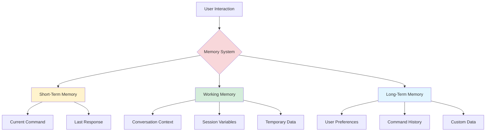
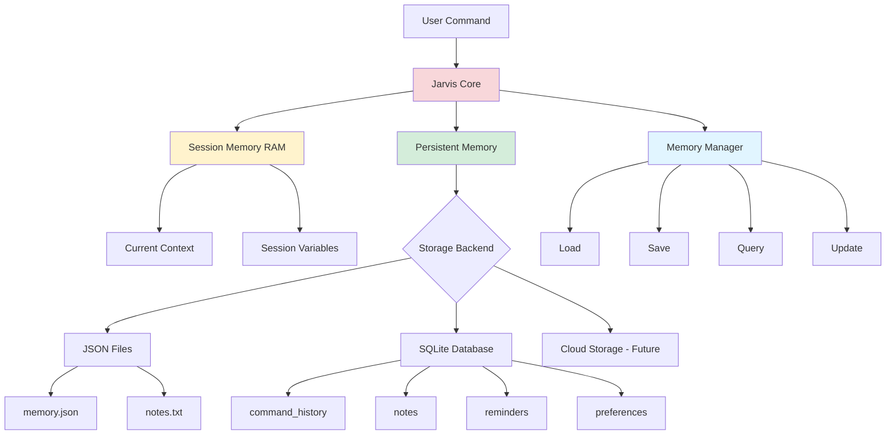

# Memory Internals

Understanding how JARVIS manages state, context, and persistent memory across sessions.

## Table of Contents

- [Memory Types](#memory-types)
- [Session Memory](#session-memory)
- [Persistent Memory](#persistent-memory)
- [Context Management](#context-management)
- [Implementation Examples](#implementation-examples)
- [Best Practices](#best-practices)

## Memory Types

JARVIS uses three types of memory to maintain intelligent, contextual interactions:



### Memory Hierarchy

| Type | Duration | Storage | Purpose |
|------|----------|---------|---------|
| **Short-Term** | Single command | RAM | Immediate processing |
| **Working** | Current session | RAM | Context tracking |
| **Long-Term** | Persistent | File/Database | User preferences, history |

## Session Memory

Session memory (working memory) exists only while JARVIS is running. It tracks:

- Conversation context
- Recent commands
- Temporary state
- Session-specific settings

### Basic Implementation

```python
class Jarvis:
    def __init__(self):
        # ... other initialization ...
        
        # Session memory
        self.session = {
            'start_time': datetime.datetime.now(),
            'command_count': 0,
            'last_command': None,
            'last_response': None,
            'context': {},
            'variables': {}
        }
    
    def process_command(self, query):
        """Process command with session tracking"""
        # Update session
        self.session['command_count'] += 1
        self.session['last_command'] = query
        
        # Process command
        response = self._execute_command(query)
        
        # Store response
        self.session['last_response'] = response
        
        return response
```

### Context Tracking

Track conversation context for follow-up questions:

```python
def process_command(self, query):
    """Process commands with context awareness"""
    
    # Check for context-dependent commands
    if query in ['more', 'continue', 'tell me more']:
        return self._continue_from_context()
    
    # Wikipedia search
    if 'wikipedia' in query:
        topic = query.replace('wikipedia', '').strip()
        
        # Save to context
        self.session['context']['last_topic'] = topic
        self.session['context']['last_skill'] = 'wikipedia'
        
        result = self.wikipedia_search(topic)
        return result
    
    # ... other commands ...

def _continue_from_context(self):
    """Continue from last context"""
    last_skill = self.session['context'].get('last_skill')
    last_topic = self.session['context'].get('last_topic')
    
    if last_skill == 'wikipedia' and last_topic:
        self.speak(f"Searching for more about {last_topic}")
        # Fetch detailed information
        detailed = wikipedia.page(last_topic).content[:500]
        self.speak(detailed)
    else:
        self.speak("I'm not sure what you'd like to continue")
```

### Session Statistics

Track and report session information:

```python
def get_session_stats(self):
    """Get current session statistics"""
    uptime = datetime.datetime.now() - self.session['start_time']
    
    stats = {
        'uptime_seconds': uptime.total_seconds(),
        'commands_processed': self.session['command_count'],
        'start_time': self.session['start_time'].isoformat()
    }
    
    return stats

def process_command(self, query):
    """Process commands"""
    
    if 'session stats' in query or 'how long' in query:
        stats = self.get_session_stats()
        minutes = stats['uptime_seconds'] / 60
        
        self.speak(f"I've been running for {minutes:.1f} minutes")
        self.speak(f"I've processed {stats['commands_processed']} commands")
        return
    
    # ... other commands ...
```

## Persistent Memory

Long-term memory survives across JARVIS sessions, storing:

- User preferences
- Command history
- Custom user data
- Learning patterns

### File-Based Storage

Simple JSON-based persistence:

```python
import json
import os
from datetime import datetime

class PersistentMemory:
    """Manage persistent memory storage"""
    
    def __init__(self, memory_file='memory.json'):
        self.memory_file = memory_file
        self.data = self.load()
    
    def load(self):
        """Load memory from file"""
        if os.path.exists(self.memory_file):
            try:
                with open(self.memory_file, 'r') as f:
                    return json.load(f)
            except:
                return self._default_memory()
        return self._default_memory()
    
    def save(self):
        """Save memory to file"""
        try:
            with open(self.memory_file, 'w') as f:
                json.dump(self.data, f, indent=2)
            return True
        except Exception as e:
            print(f"Failed to save memory: {e}")
            return False
    
    def _default_memory(self):
        """Default memory structure"""
        return {
            'user': {
                'name': None,
                'preferences': {}
            },
            'history': {
                'commands': [],
                'searches': []
            },
            'reminders': [],
            'notes': [],
            'custom': {}
        }
    
    def get(self, key, default=None):
        """Get value from memory"""
        keys = key.split('.')
        value = self.data
        
        for k in keys:
            if isinstance(value, dict) and k in value:
                value = value[k]
            else:
                return default
        
        return value
    
    def set(self, key, value):
        """Set value in memory"""
        keys = key.split('.')
        data = self.data
        
        for k in keys[:-1]:
            if k not in data:
                data[k] = {}
            data = data[k]
        
        data[keys[-1]] = value
        self.save()
    
    def append(self, key, value):
        """Append to list in memory"""
        current = self.get(key, [])
        if isinstance(current, list):
            current.append(value)
            self.set(key, current)
```

### Using Persistent Memory

```python
class Jarvis:
    def __init__(self):
        # ... other initialization ...
        self.memory = PersistentMemory()
        
        # Greet by name if known
        user_name = self.memory.get('user.name')
        if user_name:
            self.speak(f"Welcome back, {user_name}")
    
    def process_command(self, query):
        """Process commands with memory"""
        
        # Learn user's name
        if 'my name is' in query:
            name = query.replace('my name is', '').strip()
            self.memory.set('user.name', name)
            self.speak(f"Nice to meet you, {name}. I'll remember that")
            return
        
        # What's my name?
        if "what's my name" in query or "who am i" in query:
            name = self.memory.get('user.name')
            if name:
                self.speak(f"Your name is {name}")
            else:
                self.speak("I don't know your name yet. You can tell me")
            return
        
        # Save command to history
        self.memory.append('history.commands', {
            'command': query,
            'timestamp': datetime.now().isoformat()
        })
        
        # ... other commands ...
```

### Database Storage (Advanced)

For larger datasets, use SQLite:

```python
import sqlite3
from datetime import datetime

class DatabaseMemory:
    """SQLite-based memory storage"""
    
    def __init__(self, db_path='jarvis_memory.db'):
        self.db_path = db_path
        self.conn = sqlite3.connect(db_path)
        self.create_tables()
    
    def create_tables(self):
        """Create database tables"""
        cursor = self.conn.cursor()
        
        # Command history table
        cursor.execute('''
            CREATE TABLE IF NOT EXISTS command_history (
                id INTEGER PRIMARY KEY AUTOINCREMENT,
                command TEXT NOT NULL,
                timestamp DATETIME DEFAULT CURRENT_TIMESTAMP,
                response TEXT
            )
        ''')
        
        # Notes table
        cursor.execute('''
            CREATE TABLE IF NOT EXISTS notes (
                id INTEGER PRIMARY KEY AUTOINCREMENT,
                content TEXT NOT NULL,
                created_at DATETIME DEFAULT CURRENT_TIMESTAMP,
                tags TEXT
            )
        ''')
        
        # Reminders table
        cursor.execute('''
            CREATE TABLE IF NOT EXISTS reminders (
                id INTEGER PRIMARY KEY AUTOINCREMENT,
                content TEXT NOT NULL,
                due_date DATETIME,
                completed BOOLEAN DEFAULT 0,
                created_at DATETIME DEFAULT CURRENT_TIMESTAMP
            )
        ''')
        
        # User preferences
        cursor.execute('''
            CREATE TABLE IF NOT EXISTS preferences (
                key TEXT PRIMARY KEY,
                value TEXT NOT NULL,
                updated_at DATETIME DEFAULT CURRENT_TIMESTAMP
            )
        ''')
        
        self.conn.commit()
    
    def add_command_history(self, command, response=None):
        """Add command to history"""
        cursor = self.conn.cursor()
        cursor.execute(
            'INSERT INTO command_history (command, response) VALUES (?, ?)',
            (command, response)
        )
        self.conn.commit()
    
    def get_recent_commands(self, limit=10):
        """Get recent command history"""
        cursor = self.conn.cursor()
        cursor.execute(
            'SELECT command, timestamp FROM command_history ORDER BY timestamp DESC LIMIT ?',
            (limit,)
        )
        return cursor.fetchall()
    
    def add_note(self, content, tags=None):
        """Add a note"""
        cursor = self.conn.cursor()
        cursor.execute(
            'INSERT INTO notes (content, tags) VALUES (?, ?)',
            (content, tags)
        )
        self.conn.commit()
        return cursor.lastrowid
    
    def get_notes(self, limit=None):
        """Get all notes"""
        cursor = self.conn.cursor()
        query = 'SELECT id, content, created_at, tags FROM notes ORDER BY created_at DESC'
        if limit:
            query += f' LIMIT {limit}'
        cursor.execute(query)
        return cursor.fetchall()
    
    def set_preference(self, key, value):
        """Set user preference"""
        cursor = self.conn.cursor()
        cursor.execute(
            'INSERT OR REPLACE INTO preferences (key, value) VALUES (?, ?)',
            (key, value)
        )
        self.conn.commit()
    
    def get_preference(self, key, default=None):
        """Get user preference"""
        cursor = self.conn.cursor()
        cursor.execute('SELECT value FROM preferences WHERE key = ?', (key,))
        result = cursor.fetchone()
        return result[0] if result else default
```

## Context Management

### Conversation Context

Maintain multi-turn conversations:

```python
class ConversationContext:
    """Manage conversation context"""
    
    def __init__(self):
        self.context_stack = []
        self.max_context = 5  # Remember last 5 exchanges
    
    def push(self, query, response, metadata=None):
        """Add to context"""
        self.context_stack.append({
            'query': query,
            'response': response,
            'metadata': metadata or {},
            'timestamp': datetime.now()
        })
        
        # Limit context size
        if len(self.context_stack) > self.max_context:
            self.context_stack.pop(0)
    
    def get_last(self, n=1):
        """Get last n exchanges"""
        return self.context_stack[-n:] if n <= len(self.context_stack) else self.context_stack
    
    def get_last_topic(self):
        """Get the last discussed topic"""
        if self.context_stack:
            last = self.context_stack[-1]
            return last.get('metadata', {}).get('topic')
        return None
    
    def clear(self):
        """Clear context"""
        self.context_stack = []
```

### Using Context

```python
class Jarvis:
    def __init__(self):
        # ... other initialization ...
        self.context = ConversationContext()
    
    def process_command(self, query):
        """Process commands with context"""
        
        # Context-aware responses
        if query in ['what did you just say', 'repeat that', 'say that again']:
            last_response = self.context.get_last(1)
            if last_response:
                self.speak(last_response[0]['response'])
            else:
                self.speak("I haven't said anything yet")
            return
        
        # Follow-up questions
        if query.startswith('and ') or query.startswith('also '):
            last_topic = self.context.get_last_topic()
            if last_topic:
                # Continue with same topic
                query = f"{last_topic} {query}"
        
        # Process command
        response = self._execute_command(query)
        
        # Save to context
        self.context.push(query, response, {'topic': self._extract_topic(query)})
        
        return response
```

## Implementation Examples

### Example 1: Notes System

```python
def process_command(self, query):
    """Process commands"""
    
    # Take note
    if 'take a note' in query or 'make a note' in query:
        self.speak("What would you like me to note?")
        note_content = self.take_command()
        
        if note_content and note_content != 'None':
            # Save to database
            note_id = self.memory.add_note(note_content)
            self.speak(f"Note saved with ID {note_id}")
        return
    
    # Read notes
    if 'read my notes' in query or 'show my notes' in query:
        notes = self.memory.get_notes(limit=5)
        
        if notes:
            self.speak(f"You have {len(notes)} recent notes")
            for note in notes:
                note_id, content, created_at, tags = note
                self.speak(f"Note {note_id}: {content}")
        else:
            self.speak("You don't have any notes")
        return
```

### Example 2: Reminders System

```python
def process_command(self, query):
    """Process commands"""
    
    # Set reminder
    if 'remind me' in query:
        reminder = query.replace('remind me to', '').replace('remind me', '').strip()
        
        # Extract time if present
        due_date = self._extract_time(query)
        
        # Save reminder
        self.memory.set_reminder(reminder, due_date)
        
        if due_date:
            self.speak(f"I'll remind you to {reminder} at {due_date}")
        else:
            self.speak(f"Reminder set: {reminder}")
        return
    
    # Check reminders
    if 'show reminders' in query or 'what are my reminders' in query:
        reminders = self.memory.get_reminders()
        
        if reminders:
            self.speak(f"You have {len(reminders)} reminders")
            for reminder in reminders:
                self.speak(reminder['content'])
        else:
            self.speak("You don't have any reminders")
        return
```

### Example 3: Learning Preferences

```python
def process_command(self, query):
    """Process commands with learning"""
    
    # Learn user preferences
    if 'i prefer' in query or 'i like' in query:
        preference = query.replace('i prefer', '').replace('i like', '').strip()
        
        # Store preference
        preferences = self.memory.get('user.preferences', [])
        preferences.append({
            'preference': preference,
            'timestamp': datetime.now().isoformat()
        })
        self.memory.set('user.preferences', preferences)
        
        self.speak("I'll remember that")
        return
    
    # Use learned preferences
    if 'weather' in query:
        # Check if user prefers specific units
        unit_pref = self.memory.get('user.preferences.temperature_unit', 'celsius')
        # Use preference in weather report
```

## Best Practices

### 1. Memory Efficiency

Don't store everything - be selective:

```python
# Good: Store only important information
if self.is_important_command(query):
    self.memory.add_command_history(query, response)

# Bad: Store every single interaction
self.memory.add_command_history(query, response)  # Every time
```

### 2. Data Privacy

Respect user privacy:

```python
# Provide clear memory controls
def process_command(self, query):
    if 'clear my data' in query or 'forget everything' in query:
        self.speak("Are you sure you want to delete all your data?")
        confirmation = self.take_command()
        
        if 'yes' in confirmation:
            self.memory.clear_all()
            self.speak("All data has been cleared")
    
    if 'what do you know about me' in query:
        # Show user what data is stored
        self.show_stored_data()
```

### 3. Graceful Degradation

Handle missing or corrupted memory:

```python
def load_memory(self):
    """Load memory with fallback"""
    try:
        return self.memory.load()
    except Exception as e:
        logger.error(f"Failed to load memory: {e}")
        logger.info("Starting with fresh memory")
        return self._default_memory()
```

### 4. Backup and Export

Allow users to backup their data:

```python
def process_command(self, query):
    if 'export my data' in query:
        # Export to JSON
        export_file = f"jarvis_export_{datetime.now().strftime('%Y%m%d_%H%M%S')}.json"
        self.memory.export_to_file(export_file)
        self.speak(f"Data exported to {export_file}")
```

### 5. Memory Cleanup

Periodically clean old data:

```python
def cleanup_old_data(self, days=30):
    """Remove data older than specified days"""
    cutoff = datetime.now() - timedelta(days=days)
    
    # Remove old commands
    self.memory.remove_commands_before(cutoff)
    
    # Remove completed reminders
    self.memory.remove_completed_reminders()
    
    logger.info(f"Cleaned up data older than {days} days")
```

## Memory Architecture Diagram



## Next Steps

- **Add custom skills**: See [Skill Authoring Guide](skill-authoring.md)
- **Understand architecture**: See [Developer Guide](developer-guide.md)
- **Configure JARVIS**: See [Configuration Guide](configuration.md)

---

**Questions?** Check the [Developer Guide](developer-guide.md) for more information on extending JARVIS.
