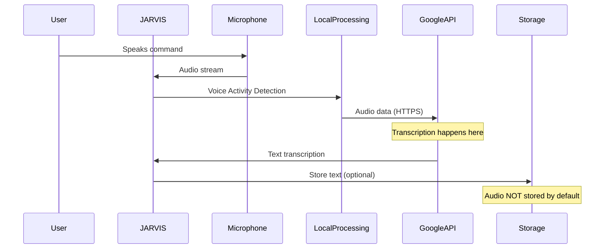

# Security Best Practices

Essential security guidelines for safely deploying and using JARVIS, protecting your privacy, and securing sensitive information.

## Table of Contents

- [Security Overview](#security-overview)
- [API Key Management](#api-key-management)
- [Voice Privacy](#voice-privacy)
- [Command Safety](#command-safety)
- [Network Security](#network-security)
- [Data Protection](#data-protection)
- [Secure Deployment](#secure-deployment)

## Security Overview

### Threat Model

Understanding potential security risks:

```mermaid
graph TB
    A[JARVIS System] --> B[API Keys Exposure]
    A --> C[Voice Data Privacy]
    A --> D[Command Injection]
    A --> E[Network Attacks]
    A --> F[Data Breaches]
    
    B --> B1[Committed to Git]
    B --> B2[Stored in Plain Text]
    B --> B3[Logged Accidentally]
    
    C --> C1[Sent to Cloud Services]
    C --> C2[Stored Locally]
    C --> C3[Network Interception]
    
    D --> D1[Malicious Commands]
    D --> D2[Code Execution]
    D --> D3[File System Access]
    
    E --> E1[Man-in-the-Middle]
    E --> E2[API Hijacking]
    E --> E3[DNS Poisoning]
    
    F --> F1[Memory Leaks]
    F --> F2[Unencrypted Storage]
    F --> F3[Unauthorized Access]
    
    style A fill:#f8d7da
    style B fill:#fff3cd
    style C fill:#fff3cd
    style D fill:#fff3cd
    style E fill:#fff3cd
    style F fill:#fff3cd
```



### Security Principles

1. **Least Privilege**: Run with minimal permissions
2. **Defense in Depth**: Multiple layers of security
3. **Secure by Default**: Safe configuration out-of-the-box
4. **Privacy First**: Minimize data collection and retention
5. **Transparency**: Users know what data is processed

## API Key Management

### ❌ Bad Practices

**Never do this:**

```python
# Bad: Hard-coded API key
api_key = "sk_live_1234567890abcdef"

# Bad: Committed to git
config = {
    "openweather_key": "my_secret_key_123"
}

# Bad: Stored in source code
WEATHER_API_KEY = "actual_key_here"
```

### ✅ Good Practices

**1. Environment Variables**

```bash
# .bashrc or .zshrc
export OPENWEATHER_API_KEY="your_key_here"
export WOLFRAMALPHA_API_KEY="your_key_here"
```

```python
# In your code
import os

api_key = os.environ.get('OPENWEATHER_API_KEY')
if not api_key:
    raise ValueError("OPENWEATHER_API_KEY not set")
```

**2. Configuration Files (Gitignored)**

```json
// config.json
{
  "apis": {
    "openweathermap": {
      "api_key": "your_key_here"
    }
  }
}
```

```gitignore
# .gitignore
config.json
.env
*.key
secrets/
```

**3. Secret Management Tools**

```python
# Using python-dotenv
from dotenv import load_dotenv
import os

load_dotenv()  # Load from .env file
api_key = os.getenv('OPENWEATHER_API_KEY')
```

**4. Encrypted Storage**

```python
from cryptography.fernet import Fernet
import os

class SecureConfig:
    """Encrypted configuration storage"""
    
    def __init__(self, key_file='secret.key'):
        self.key_file = key_file
        self.key = self._load_or_create_key()
        self.cipher = Fernet(self.key)
    
    def _load_or_create_key(self):
        """Load encryption key or create new one"""
        if os.path.exists(self.key_file):
            with open(self.key_file, 'rb') as f:
                return f.read()
        else:
            key = Fernet.generate_key()
            with open(self.key_file, 'wb') as f:
                f.write(key)
            return key
    
    def encrypt(self, data):
        """Encrypt data"""
        return self.cipher.encrypt(data.encode())
    
    def decrypt(self, encrypted_data):
        """Decrypt data"""
        return self.cipher.decrypt(encrypted_data).decode()
    
    def save_api_key(self, service, api_key):
        """Securely save API key"""
        encrypted = self.encrypt(api_key)
        with open(f'{service}.enc', 'wb') as f:
            f.write(encrypted)
    
    def load_api_key(self, service):
        """Load encrypted API key"""
        try:
            with open(f'{service}.enc', 'rb') as f:
                encrypted = f.read()
            return self.decrypt(encrypted)
        except FileNotFoundError:
            return None
```

### API Key Rotation

Regularly rotate API keys:

```python
def rotate_api_key(self, service):
    """Rotate API key for a service"""
    print(f"Please generate a new API key for {service}")
    print("1. Visit the service's dashboard")
    print("2. Generate new key")
    print("3. Enter it below")
    
    new_key = input("New API key: ").strip()
    
    # Validate key format
    if self.validate_api_key(service, new_key):
        self.config.save_api_key(service, new_key)
        print("API key updated successfully")
    else:
        print("Invalid API key format")
```

### Key Validation

Validate keys before storage:

```python
def validate_api_key(self, service, key):
    """Validate API key format"""
    validators = {
        'openweathermap': lambda k: len(k) == 32 and k.isalnum(),
        'wolframalpha': lambda k: len(k) > 10 and '-' in k
    }
    
    validator = validators.get(service)
    if validator:
        return validator(key)
    return len(key) > 0
```

## Voice Privacy

### Understanding Voice Data Flow



### Privacy Considerations

**What Gets Sent to Google:**
- Audio recordings of your commands
- Temporary storage for processing
- Not permanently stored by Google (for Google Speech Recognition API)

**What Stays Local:**
- Text transcriptions (unless you save them)
- Command history (if you enable it)
- Configuration and preferences

### Privacy-Enhancing Measures

**1. Local Speech Recognition (Advanced)**

Use offline recognition (less accurate):

```python
import speech_recognition as sr

recognizer = sr.Recognizer()

# Use Sphinx (offline)
with sr.Microphone() as source:
    audio = recognizer.listen(source)
    try:
        text = recognizer.recognize_sphinx(audio)
    except sr.UnknownValueError:
        text = "None"
```

**2. Audio Data Minimization**

Don't store audio unnecessarily:

```python
def take_command(self):
    """Capture command without storing audio"""
    with sr.Microphone() as source:
        audio = self.recognizer.listen(source)
    
    # Process immediately
    text = self.recognizer.recognize_google(audio)
    
    # Audio object is garbage collected
    # No permanent storage
    return text
```

**3. Opt-out of Logging**

```python
def take_command(self, log_commands=False):
    """Take command with optional logging"""
    query = self._capture_voice()
    
    # Only log if explicitly enabled
    if log_commands and query != "None":
        self.memory.log_command(query)
    
    return query
```

**4. User Notification**

Always inform users about data processing:

```python
def first_run_privacy_notice(self):
    """Display privacy notice on first run"""
    if not self.config.get('privacy_accepted'):
        print("\n=== PRIVACY NOTICE ===")
        print("JARVIS uses Google Speech Recognition API.")
        print("Your voice commands are sent to Google for transcription.")
        print("Audio is processed temporarily and not permanently stored.")
        print("\nYou can:")
        print("- Use text input instead of voice")
        print("- Enable offline recognition (less accurate)")
        print("- Review our privacy policy")
        
        accept = input("\nDo you accept? (yes/no): ")
        
        if accept.lower() == 'yes':
            self.config.set('privacy_accepted', True)
            return True
        else:
            print("Voice features will be disabled.")
            return False
```

## Command Safety

### Command Injection Prevention

**❌ Dangerous: Using eval()**

```python
# NEVER DO THIS
if 'calculate' in query:
    expression = query.replace('calculate', '').strip()
    result = eval(expression)  # DANGEROUS!
```

**Why it's dangerous:**
```python
# User could say: "calculate __import__('os').system('rm -rf /')"
# This would execute system commands!
```

**✅ Safe: Controlled Evaluation**

```python
import ast
import operator

def safe_eval(self, expression):
    """Safely evaluate mathematical expressions"""
    allowed_operators = {
        ast.Add: operator.add,
        ast.Sub: operator.sub,
        ast.Mult: operator.mul,
        ast.Div: operator.truediv,
        ast.Pow: operator.pow,
        ast.USub: operator.neg
    }
    
    try:
        node = ast.parse(expression, mode='eval')
        
        def eval_node(node):
            if isinstance(node, ast.Num):
                return node.n
            elif isinstance(node, ast.BinOp):
                left = eval_node(node.left)
                right = eval_node(node.right)
                op = allowed_operators.get(type(node.op))
                if op:
                    return op(left, right)
                raise ValueError("Unsupported operator")
            elif isinstance(node, ast.UnaryOp):
                operand = eval_node(node.operand)
                op = allowed_operators.get(type(node.op))
                if op:
                    return op(operand)
                raise ValueError("Unsupported operator")
            else:
                raise ValueError("Unsupported operation")
        
        return eval_node(node.body)
    except:
        return None
```

### File System Access Control

**Restrict file operations:**

```python
import os

class SafeFileOperations:
    """Safe file operations with path validation"""
    
    def __init__(self, allowed_dirs):
        self.allowed_dirs = [os.path.abspath(d) for d in allowed_dirs]
    
    def is_safe_path(self, path):
        """Check if path is within allowed directories"""
        abs_path = os.path.abspath(path)
        return any(abs_path.startswith(allowed) for allowed in self.allowed_dirs)
    
    def safe_read(self, path):
        """Safely read file"""
        if not self.is_safe_path(path):
            raise PermissionError("Access to this path is not allowed")
        
        with open(path, 'r') as f:
            return f.read()
    
    def safe_write(self, path, content):
        """Safely write file"""
        if not self.is_safe_path(path):
            raise PermissionError("Access to this path is not allowed")
        
        with open(path, 'w') as f:
            f.write(content)

# Usage
file_ops = SafeFileOperations([
    os.path.expanduser('~/Documents/JARVIS'),
    os.path.expanduser('~/Downloads')
])
```

### Command Whitelisting

Only allow specific commands:

```python
ALLOWED_COMMANDS = {
    'wikipedia', 'weather', 'time', 'date',
    'open youtube', 'open google', 'calculate',
    'note', 'reminder', 'exit'
}

def is_command_allowed(self, query):
    """Check if command is in whitelist"""
    return any(cmd in query for cmd in ALLOWED_COMMANDS)

def process_command(self, query):
    """Process only whitelisted commands"""
    if not self.is_command_allowed(query):
        self.speak("I'm not authorized to do that")
        self.log_security_event('unauthorized_command', query)
        return
    
    # Process command
    # ...
```

### Input Validation

Validate all user inputs:

```python
def validate_input(self, query, max_length=500):
    """Validate user input"""
    # Length check
    if len(query) > max_length:
        return False, "Command too long"
    
    # Character whitelist (alphanumeric + common punctuation)
    import re
    if not re.match(r'^[a-zA-Z0-9\s.,!?\'"]+$', query):
        return False, "Invalid characters"
    
    # SQL injection patterns (if using database)
    sql_patterns = ['SELECT', 'DROP', 'INSERT', 'DELETE', 'UPDATE', '--', ';']
    if any(pattern in query.upper() for pattern in sql_patterns):
        return False, "Suspicious pattern detected"
    
    return True, "Valid"
```

## Network Security

### HTTPS Enforcement

Always use HTTPS for API calls:

```python
import requests

def make_api_call(self, url, **kwargs):
    """Make secure API call"""
    # Ensure HTTPS
    if not url.startswith('https://'):
        if url.startswith('http://'):
            url = url.replace('http://', 'https://')
        else:
            raise ValueError("URL must use HTTPS")
    
    # Verify SSL certificates
    kwargs.setdefault('verify', True)
    
    # Set timeout
    kwargs.setdefault('timeout', 10)
    
    try:
        response = requests.get(url, **kwargs)
        response.raise_for_status()
        return response
    except requests.exceptions.SSLError:
        raise Exception("SSL certificate verification failed")
    except requests.exceptions.Timeout:
        raise Exception("Request timed out")
    except requests.exceptions.RequestException as e:
        raise Exception(f"API request failed: {e}")
```

### Certificate Pinning (Advanced)

Pin SSL certificates for critical services:

```python
import requests
import hashlib

def verify_certificate_pin(self, cert_pem, expected_pin):
    """Verify SSL certificate pin"""
    # Calculate certificate fingerprint
    cert_hash = hashlib.sha256(cert_pem.encode()).hexdigest()
    return cert_hash == expected_pin

CERTIFICATE_PINS = {
    'api.openweathermap.org': 'expected_sha256_hash_here'
}
```

### Rate Limiting

Protect against abuse:

```python
from collections import defaultdict
import time

class RateLimiter:
    """Rate limit API calls"""
    
    def __init__(self):
        self.calls = defaultdict(list)
        self.limits = {
            'openweathermap': (60, 60),  # 60 calls per 60 seconds
            'wolframalpha': (100, 3600)  # 100 calls per hour
        }
    
    def is_allowed(self, service):
        """Check if call is allowed"""
        if service not in self.limits:
            return True
        
        max_calls, window = self.limits[service]
        now = time.time()
        
        # Clean old calls
        self.calls[service] = [
            t for t in self.calls[service]
            if now - t < window
        ]
        
        # Check limit
        if len(self.calls[service]) >= max_calls:
            return False
        
        # Record call
        self.calls[service].append(now)
        return True
```

## Data Protection

### Encrypt Sensitive Data

```python
from cryptography.fernet import Fernet
import json

class EncryptedStorage:
    """Encrypted data storage"""
    
    def __init__(self, key_file='encryption.key'):
        self.key = self._load_or_create_key(key_file)
        self.cipher = Fernet(self.key)
    
    def _load_or_create_key(self, key_file):
        """Load or create encryption key"""
        if os.path.exists(key_file):
            with open(key_file, 'rb') as f:
                return f.read()
        key = Fernet.generate_key()
        with open(key_file, 'wb') as f:
            f.write(key)
        # Secure file permissions
        os.chmod(key_file, 0o600)
        return key
    
    def save(self, data, filename):
        """Save encrypted data"""
        json_data = json.dumps(data)
        encrypted = self.cipher.encrypt(json_data.encode())
        with open(filename, 'wb') as f:
            f.write(encrypted)
    
    def load(self, filename):
        """Load encrypted data"""
        with open(filename, 'rb') as f:
            encrypted = f.read()
        decrypted = self.cipher.decrypt(encrypted)
        return json.loads(decrypted.decode())
```

### Secure File Permissions

```python
import os
import stat

def secure_file_permissions(filepath):
    """Set secure file permissions (owner read/write only)"""
    os.chmod(filepath, stat.S_IRUSR | stat.S_IWUSR)  # 0o600

def secure_directory_permissions(dirpath):
    """Set secure directory permissions"""
    os.chmod(dirpath, stat.S_IRWXU)  # 0o700
```

### Data Sanitization

Remove sensitive data from logs:

```python
import re

def sanitize_log(self, message):
    """Remove sensitive information from logs"""
    # Remove API keys
    message = re.sub(r'api[_-]?key[=:]\s*["\']?[\w-]+["\']?', 'api_key=[REDACTED]', message, flags=re.IGNORECASE)
    
    # Remove passwords
    message = re.sub(r'password[=:]\s*["\']?[\w-]+["\']?', 'password=[REDACTED]', message, flags=re.IGNORECASE)
    
    # Remove email addresses
    message = re.sub(r'\b[A-Za-z0-9._%+-]+@[A-Za-z0-9.-]+\.[A-Z|a-z]{2,}\b', '[EMAIL]', message)
    
    # Remove credit card numbers
    message = re.sub(r'\b\d{4}[\s-]?\d{4}[\s-]?\d{4}[\s-]?\d{4}\b', '[CARD]', message)
    
    return message
```

## Secure Deployment

### Checklist

- [ ] API keys in environment variables or encrypted storage
- [ ] config.json added to .gitignore
- [ ] File permissions set to 0o600 for sensitive files
- [ ] HTTPS enforced for all API calls
- [ ] SSL certificate verification enabled
- [ ] Input validation implemented
- [ ] Command whitelisting in place
- [ ] Rate limiting configured
- [ ] Logging sanitized
- [ ] Privacy notice displayed
- [ ] Regular security updates planned

### Running as Non-Root

```bash
# Never run as root
# Create dedicated user
sudo useradd -m -s /bin/bash jarvis
sudo su - jarvis

# Run JARVIS
python jarvis.txt
```

### Firewall Configuration

```bash
# Allow only necessary outbound connections
sudo ufw default deny outgoing
sudo ufw allow out 443/tcp  # HTTPS
sudo ufw allow out 80/tcp   # HTTP (if needed)
sudo ufw allow out 53/tcp   # DNS
sudo ufw allow out 53/udp   # DNS
sudo ufw enable
```

### Security Monitoring

```python
import logging

class SecurityLogger:
    """Log security events"""
    
    def __init__(self):
        self.logger = logging.getLogger('security')
        handler = logging.FileHandler('security.log')
        handler.setFormatter(
            logging.Formatter('%(asctime)s - %(levelname)s - %(message)s')
        )
        self.logger.addHandler(handler)
        self.logger.setLevel(logging.WARNING)
    
    def log_unauthorized_access(self, command):
        """Log unauthorized command attempt"""
        self.logger.warning(f"Unauthorized command: {command}")
    
    def log_api_failure(self, service, error):
        """Log API authentication failure"""
        self.logger.error(f"API failure for {service}: {error}")
    
    def log_suspicious_activity(self, activity):
        """Log suspicious behavior"""
        self.logger.warning(f"Suspicious activity: {activity}")
```

## Next Steps

- **Configure safely**: See [Configuration Guide](configuration.md)
- **Extend securely**: See [Skill Authoring Guide](skill-authoring.md)
- **Understand architecture**: See [Developer Guide](developer-guide.md)

---

**Security is everyone's responsibility.** Report security issues privately to the maintainers.
