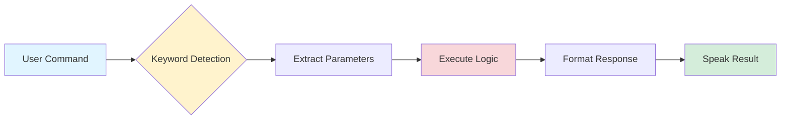

# Skill Authoring Guide

Learn how to create custom skills for JARVIS, extending its capabilities with your own commands and integrations.

## Table of Contents

- [What is a Skill?](#what-is-a-skill)
- [Skill Anatomy](#skill-anatomy)
- [Basic Skill Creation](#basic-skill-creation)
- [Advanced Skills](#advanced-skills)
- [Best Practices](#best-practices)
- [Example Skills](#example-skills)
- [Testing Skills](#testing-skills)

## What is a Skill?

A **skill** is a specific capability that JARVIS can perform in response to user commands. Each skill:

- Listens for specific trigger words or phrases
- Processes the user's request
- Performs an action or retrieves information
- Responds to the user with results

### Current Built-in Skills

| Skill | Trigger | Description |
|-------|---------|-------------|
| Wikipedia | "wikipedia" | Search and read Wikipedia articles |
| Web Navigation | "open youtube", "open google" | Open websites in browser |
| Time | "time" | Tell current time |
| Weather | "weather" | Report weather conditions |
| Exit | "exit", "goodbye" | Terminate JARVIS |

## Skill Anatomy

Every skill follows this basic structure:



### Core Components

1. **Trigger Detection**: Identify if the command matches this skill
2. **Parameter Extraction**: Parse relevant information from the command
3. **Execution Logic**: Perform the actual task
4. **Response Formatting**: Prepare user-friendly output
5. **Feedback**: Speak or display the result

## Basic Skill Creation

### Step 1: Simple Command Response

Let's create a skill that tells jokes:

```python
def process_command(self, query):
    """Process user commands"""
    
    # Joke skill
    if 'joke' in query:
        import random
        jokes = [
            "Why do programmers prefer dark mode? Because light attracts bugs!",
            "Why do Python programmers prefer snakes? Because they don't have to deal with pointers!",
            "What's the object-oriented way to become wealthy? Inheritance."
        ]
        joke = random.choice(jokes)
        self.speak(joke)
        return
    
    # ... existing skills ...
```

**Usage:**
- User says: "Tell me a joke"
- JARVIS responds with a random joke

### Step 2: Parameter Extraction

Create a skill that sets reminders:

```python
def process_command(self, query):
    """Process user commands"""
    
    # Reminder skill
    if 'remind me' in query:
        # Extract what to remind about
        reminder_text = query.replace('remind me to', '').replace('remind me', '').strip()
        
        if reminder_text:
            self.speak(f"I'll remind you to {reminder_text}")
            # Store reminder (simplified - see Memory Internals for persistence)
            print(f"REMINDER: {reminder_text}")
        else:
            self.speak("What would you like me to remind you about?")
        return
    
    # ... existing skills ...
```

**Usage:**
- User: "Remind me to call mom"
- JARVIS: "I'll remind you to call mom"

### Step 3: External API Integration

Create a skill that fetches random facts:

```python
def process_command(self, query):
    """Process user commands"""
    
    # Random fact skill
    if 'tell me a fact' in query or 'random fact' in query:
        self.get_random_fact()
        return
    
    # ... existing skills ...

def get_random_fact(self):
    """Fetch and speak a random fact"""
    try:
        response = requests.get('https://uselessfacts.jsph.pl/random.json?language=en')
        data = response.json()
        fact = data.get('text', 'No fact available')
        self.speak(fact)
        print(f"Fact: {fact}")
    except Exception as e:
        self.speak("Sorry, I couldn't fetch a fact right now")
        print(f"Error: {e}")
```

**Usage:**
- User: "Tell me a fact"
- JARVIS responds with a random interesting fact

## Advanced Skills

### Multi-Step Conversation Skills

Create a skill that has back-and-forth conversation:

```python
def process_command(self, query):
    """Process user commands"""
    
    # Note-taking skill with confirmation
    if 'take a note' in query or 'make a note' in query:
        self.take_note()
        return
    
    # ... existing skills ...

def take_note(self):
    """Take notes with user confirmation"""
    self.speak("What would you like me to note?")
    note_content = self.take_command()
    
    if note_content and note_content != 'None':
        # Save note to file
        import datetime
        timestamp = datetime.datetime.now().strftime("%Y-%m-%d %H:%M:%S")
        
        with open('notes.txt', 'a') as f:
            f.write(f"[{timestamp}] {note_content}\n")
        
        self.speak("Note saved. Would you like to add another note?")
        response = self.take_command()
        
        if 'yes' in response:
            self.take_note()  # Recursive call for another note
        else:
            self.speak("Okay, returning to listening mode")
    else:
        self.speak("I didn't catch that. Note cancelled")
```

### Skills with Multiple Triggers

```python
def process_command(self, query):
    """Process user commands"""
    
    # Music control with multiple triggers
    if any(word in query for word in ['play music', 'start music', 'play song']):
        self.play_music()
    elif any(word in query for word in ['stop music', 'pause music', 'stop song']):
        self.stop_music()
    elif 'volume' in query:
        if 'up' in query or 'increase' in query:
            self.adjust_volume('up')
        elif 'down' in query or 'decrease' in query:
            self.adjust_volume('down')
        else:
            self.speak("Would you like me to turn the volume up or down?")
```

### Contextual Skills

Skills that remember context from previous commands:

```python
class Jarvis:
    def __init__(self):
        # ... existing initialization ...
        self.context = {}  # Store conversation context
    
    def process_command(self, query):
        """Process user commands with context awareness"""
        
        # Search skill that remembers last search
        if 'search' in query or 'look up' in query:
            search_term = query.replace('search', '').replace('look up', '').strip()
            self.context['last_search'] = search_term
            self.web_search(search_term)
        
        # Follow-up command
        elif 'more about' in query or 'tell me more' in query:
            if 'last_search' in self.context:
                last_term = self.context['last_search']
                self.speak(f"Searching for more information about {last_term}")
                self.detailed_search(last_term)
            else:
                self.speak("I'm not sure what you'd like to know more about")
```

## Best Practices

### 1. Clear Trigger Words

Use specific, unique trigger words to avoid conflicts:

```python
# Good: Specific triggers
if 'weather forecast' in query:
    # Weather forecast skill
elif 'weather' in query:
    # Current weather skill

# Bad: Overlapping triggers
if 'weather' in query:
    # This catches both, making the second unreachable
```

### 2. Error Handling

Always handle errors gracefully:

```python
def process_command(self, query):
    if 'calculate' in query:
        try:
            # Extract expression
            expression = query.replace('calculate', '').strip()
            result = eval(expression)  # Note: Use ast.literal_eval in production
            self.speak(f"The answer is {result}")
        except ZeroDivisionError:
            self.speak("Cannot divide by zero")
        except SyntaxError:
            self.speak("Invalid expression")
        except Exception as e:
            self.speak("Sorry, I couldn't calculate that")
            print(f"Calculation error: {e}")
```

### 3. User Feedback

Provide immediate feedback and confirmation:

```python
def process_command(self, query):
    if 'send email' in query:
        self.speak("Preparing to send email")  # Acknowledge immediately
        
        # Do processing
        success = self.send_email()
        
        if success:
            self.speak("Email sent successfully")  # Confirm completion
        else:
            self.speak("Failed to send email")  # Report failure
```

### 4. Configuration

Make skills configurable rather than hard-coded:

```python
def get_news(self):
    """Get news headlines"""
    # Good: Use configuration
    api_key = self.config.get('apis', {}).get('news', {}).get('api_key')
    category = self.config.get('news', {}).get('category', 'technology')
    max_headlines = self.config.get('news', {}).get('max_headlines', 5)
    
    # Bad: Hard-coded values
    # api_key = "hardcoded_key_123"
    # category = "technology"
```

### 5. Modularity

Separate skill logic from command processing:

```python
# Good: Modular design
def process_command(self, query):
    if 'calendar' in query:
        if 'add' in query or 'schedule' in query:
            self.add_calendar_event()
        elif 'show' in query or 'what' in query:
            self.show_calendar_events()
        elif 'delete' in query or 'remove' in query:
            self.delete_calendar_event()

def add_calendar_event(self):
    """Handle adding calendar events"""
    # All the logic here
    pass

# Bad: Everything in process_command
def process_command(self, query):
    if 'calendar' in query:
        # 100 lines of calendar logic directly here
```

## Example Skills

### Example 1: Currency Converter

```python
def process_command(self, query):
    if 'convert currency' in query or 'exchange rate' in query:
        self.convert_currency(query)

def convert_currency(self, query):
    """Convert between currencies"""
    try:
        # Example: "convert 100 dollars to euros"
        words = query.split()
        
        # Find the amount
        amount = None
        for word in words:
            if word.replace('.', '').isdigit():
                amount = float(word)
                break
        
        if amount is None:
            self.speak("How much would you like to convert?")
            return
        
        # Simple conversion (in production, use an API like exchangerate-api.io)
        conversion_rates = {
            'euros': 0.85,
            'pounds': 0.73,
            'yen': 110.0
        }
        
        for currency, rate in conversion_rates.items():
            if currency in query:
                result = amount * rate
                self.speak(f"{amount} dollars is approximately {result:.2f} {currency}")
                return
        
        self.speak("I don't recognize that currency")
    except Exception as e:
        self.speak("Sorry, I couldn't convert that")
        print(f"Currency conversion error: {e}")
```

### Example 2: System Information

```python
import platform
import psutil

def process_command(self, query):
    if 'system info' in query or 'computer info' in query:
        self.system_info()

def system_info(self):
    """Report system information"""
    try:
        # Get system info
        system = platform.system()
        processor = platform.processor()
        ram = psutil.virtual_memory()
        ram_gb = ram.total / (1024 ** 3)
        ram_percent = ram.percent
        
        # Report
        self.speak(f"You are running {system}")
        self.speak(f"Your processor is {processor}")
        self.speak(f"You have {ram_gb:.1f} gigabytes of RAM")
        self.speak(f"Current RAM usage is {ram_percent} percent")
    except Exception as e:
        self.speak("Could not retrieve system information")
        print(f"System info error: {e}")
```

### Example 3: Smart File Organizer

```python
import os
import shutil

def process_command(self, query):
    if 'organize downloads' in query:
        self.organize_downloads()

def organize_downloads(self):
    """Organize files in downloads folder by type"""
    try:
        downloads_path = os.path.expanduser("~/Downloads")
        
        # Define categories
        categories = {
            'Images': ['.jpg', '.jpeg', '.png', '.gif', '.bmp'],
            'Documents': ['.pdf', '.doc', '.docx', '.txt', '.xlsx'],
            'Videos': ['.mp4', '.avi', '.mov', '.mkv'],
            'Archives': ['.zip', '.rar', '.7z', '.tar'],
            'Audio': ['.mp3', '.wav', '.flac', '.aac']
        }
        
        files_moved = 0
        
        # Create category folders and move files
        for category, extensions in categories.items():
            category_path = os.path.join(downloads_path, category)
            os.makedirs(category_path, exist_ok=True)
            
            for file in os.listdir(downloads_path):
                file_path = os.path.join(downloads_path, file)
                
                if os.path.isfile(file_path):
                    file_ext = os.path.splitext(file)[1].lower()
                    
                    if file_ext in extensions:
                        shutil.move(file_path, os.path.join(category_path, file))
                        files_moved += 1
        
        self.speak(f"Downloads organized. Moved {files_moved} files")
    except Exception as e:
        self.speak("Could not organize downloads")
        print(f"Organization error: {e}")
```

### Example 4: Quick Math Skill

```python
import re
import ast
import operator

def process_command(self, query):
    if 'calculate' in query or 'what is' in query:
        self.calculate(query)

def calculate(self, query):
    """Safely calculate mathematical expressions"""
    try:
        # Extract the mathematical expression
        # Support both "calculate 5 plus 3" and "what is 5 plus 3"
        expression = query.replace('calculate', '').replace('what is', '').strip()
        
        # Replace words with operators
        replacements = {
            'plus': '+',
            'minus': '-',
            'times': '*',
            'multiplied by': '*',
            'divided by': '/',
            'to the power of': '**',
            'squared': '**2'
        }
        
        for word, symbol in replacements.items():
            expression = expression.replace(word, symbol)
        
        # Safe evaluation using ast
        result = self.safe_eval(expression)
        
        if result is not None:
            self.speak(f"The answer is {result}")
        else:
            self.speak("I couldn't calculate that")
    except Exception as e:
        self.speak("Sorry, I couldn't perform that calculation")
        print(f"Calculation error: {e}")

def safe_eval(self, expression):
    """Safely evaluate mathematical expressions"""
    # Allowed operators
    operators = {
        ast.Add: operator.add,
        ast.Sub: operator.sub,
        ast.Mult: operator.mul,
        ast.Div: operator.truediv,
        ast.Pow: operator.pow,
        ast.USub: operator.neg
    }
    
    try:
        node = ast.parse(expression, mode='eval')
        
        def eval_node(node):
            if isinstance(node, ast.Num):
                return node.n
            elif isinstance(node, ast.BinOp):
                left = eval_node(node.left)
                right = eval_node(node.right)
                return operators[type(node.op)](left, right)
            elif isinstance(node, ast.UnaryOp):
                operand = eval_node(node.operand)
                return operators[type(node.op)](operand)
            else:
                raise ValueError("Unsupported operation")
        
        return eval_node(node.body)
    except:
        return None
```

## Testing Skills

### Unit Testing

Create test cases for your skills:

```python
# test_skills.py
import unittest
from jarvis import Jarvis

class TestSkills(unittest.TestCase):
    def setUp(self):
        self.jarvis = Jarvis()
    
    def test_calculation(self):
        result = self.jarvis.safe_eval("5 + 3")
        self.assertEqual(result, 8)
    
    def test_weather_api_key(self):
        # Test that API key is configured
        api_key = self.jarvis.config.get('apis', {}).get('openweathermap', {}).get('api_key')
        self.assertIsNotNone(api_key)
        self.assertNotEqual(api_key, 'YOUR_API_KEY')

if __name__ == '__main__':
    unittest.main()
```

### Manual Testing Checklist

When testing a new skill:

- [ ] Test with exact trigger phrase
- [ ] Test with variations of trigger phrase
- [ ] Test with missing parameters
- [ ] Test with invalid parameters
- [ ] Test error conditions (no internet, invalid API key, etc.)
- [ ] Test response timing (not too slow)
- [ ] Test that it doesn't interfere with other skills
- [ ] Test error messages are user-friendly

### Debugging Skills

Add debug logging:

```python
import logging

logger = logging.getLogger(__name__)

def process_command(self, query):
    logger.debug(f"Processing command: {query}")
    
    if 'my skill' in query:
        logger.info("My skill triggered")
        try:
            result = self.my_skill_function()
            logger.info(f"Skill completed successfully: {result}")
        except Exception as e:
            logger.error(f"Skill failed: {e}", exc_info=True)
```

## Skill Template

Use this template when creating new skills:

```python
def process_command(self, query):
    """Process user commands"""
    
    # Your skill trigger
    if 'your_trigger' in query:
        self.your_skill_name(query)
        return
    
    # ... existing skills ...

def your_skill_name(self, query=None):
    """
    Brief description of what this skill does
    
    Args:
        query: The user's voice command (optional)
    
    Returns:
        None (speaks response to user)
    """
    try:
        # Step 1: Provide immediate feedback
        self.speak("Working on that")
        
        # Step 2: Extract parameters if needed
        # parameter = self.extract_parameter(query)
        
        # Step 3: Validate inputs
        # if not parameter:
        #     self.speak("I need more information")
        #     return
        
        # Step 4: Execute main logic
        # result = self.do_something()
        
        # Step 5: Provide result feedback
        # self.speak(f"Here is the result: {result}")
        
    except Exception as e:
        # Step 6: Handle errors gracefully
        self.speak("Sorry, something went wrong")
        logger.error(f"Error in your_skill_name: {e}", exc_info=True)
```

## Next Steps

- **Understand architecture**: See [Developer Guide](developer-guide.md)
- **Learn about persistence**: See [Memory Internals](memory-internals.md)
- **Secure your skills**: See [Security Best Practices](security.md)

---

**Questions?** Open an issue or check existing skills in `jarvis.txt` for inspiration!
